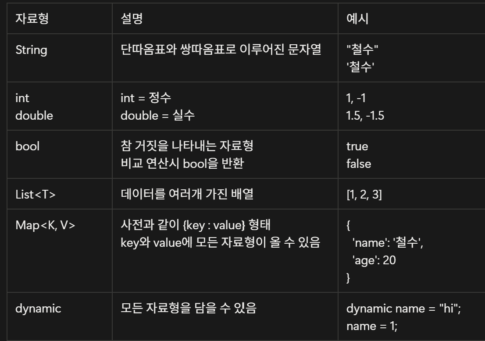

## Why Flutter

앱 개발 방법

1. 네이티브 앱:하나의 앱을 Android와 iOS를 각각의 개발 방법에 따라 개별로 두 번 만드는 방법

2. 크로스 플랫폼 앱: 하나의 프로그래밍 언어와 소스코드로 Android와 iOS를 모두 개발하는 방법
   ex. flutter

-> 크로스 플랫폼 앱이 훨씬 더 개발시간을 단축할 수 있음

## Flutter 이해하기

flutter는 모든 것이 위젯으로 만들어져 있음

-위젯: 레고블럭과 같이 앱을 만드는데 사용되는 작은 모듈

-위젯트리: 위젯들의 조합이 나무와 같이 생겼다고 함

Cupertino: iOS에서 사용되는 style을 flutter에서 사용할 수 있도록 위젯으로 만듦

Material Components widgets: 구글 안드로이드에서 사용되는 style을 flutter에서 사용할 수 있도록 위젯으로 만듦

Custom Widget: 특정 플랫폼에 종속되지 않은 고유의 디자인을 입힘

-> 사용성만 해치지 않는다면 앱을 출시할 수 있음

## Flutter 맛보기 - 프로젝트 준비 & 로그인 화면 프로젝트 만들기

Emulaotr(에뮬레이터): 실제 기기를 연결하지 않고도 개발할 수 있도록 만든 컴퓨터 상의 가상의 휴대폰

## Dart 문법

### 자료형

### 흐름 제어문

1.조건문(if문)

2.반복문

### 함수

함수: 여러 코드를 묶어 놓은 상자

함수의 이름은 카멜케이스 규칙을 따름

함수의 이름은 일반적으로 동사로 시작함

함수도 값을 입력하여 출력을 받을 수 있음

입력값을 이름과 함께 전달받는 방법

->`{}`를 사용하여 가능 (**이름지정 매개변수**)

이름 지정 매개변수의 값을 필수로 전달하도록 만드는 방법

-> `required` 사용

### 클래스

클래스: 변수와 함수를 모아둔 틀

클래스 이름은 파스칼 케이스를 따름 (모든 첫 문자는 대문자)

속성: 클래스 내의 변수

메소드: 클래스 내의 함수

생성자: 클래스명과 동일한 함수 -> 반환 타입 적지 않음

인스턴스: 생성자 함수를 호출하여 클래스에서 정의해 둔 속성과 메소드를 가진 데이터 객체를 만들 수 있고, 이를 인스턴스라고 함.
